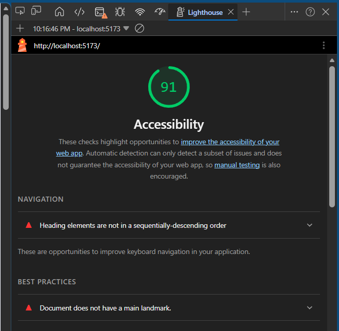

# React + Vite

This template provides a minimal setup to get React working in Vite with HMR and some ESLint rules.

Currently, two official plugins are available:

- [@vitejs/plugin-react](https://github.com/vitejs/vite-plugin-react/blob/main/packages/plugin-react) uses [Oxc](https://oxc.rs)
- [@vitejs/plugin-react-swc](https://github.com/vitejs/vite-plugin-react/blob/main/packages/plugin-react-swc) uses [SWC](https://swc.rs/)

## React Compiler

The React Compiler is not enabled on this template because of its impact on dev & build performances. To add it, see [this documentation](https://react.dev/learn/react-compiler/installation).

## Expanding the ESLint configuration

If you are developing a production application, we recommend using TypeScript with type-aware lint rules enabled. Check out the [TS template](https://github.com/vitejs/vite/tree/main/packages/create-vite/template-react-ts) for information on how to integrate TypeScript and [`typescript-eslint`](https://typescript-eslint.io) in your project.

## Changelog

- Lab.01
- Lab.02 
  - 05.01
    - created branch (lab02)
    - stored `./data.json` import in `data` variable.
    - uncommented `Gallery` within `App.jsx` and passed `{beasts}` as props.
    - used `.map()` on `<HornedBeast />`.
    - Feature01, failed... "error to resolve imports from bootstrap & data..."
      - installed bootstrap
      - missing data.json file...
  - 05.07
    - updated `data.json` with correct links.
    - Images, titles, and descriptions now load.
    - added optional chaining to `props.beasts?.map()` in `Gallery.jsx` to protect from failed imports, re-render errors, etc.
    - created state in `HornedBeast.jsx`, added favoriting capability for each individual beast with counter.
    - imported `Container`, `Row`, and `Col` from `bootstrap` to modify layout of content in `Gallery.jsx`.
    - imported `Card` from `bootstrap` to `HornedBeast.jsx`.
    - made gallery cards look more consistent when rendering.
    - 
- Lab.03
  - 05.10
    - created modal branch
    - created state for beast selection and modal inside `App.jsx` component, `selectedBeast`, `showModal`.
    - created handler function (`handleSelectedBeast()`) inside `App.jsx` component.
    - passed `handleSelectBeast` into `<Gallery />` component inside `App.jsx`; `<Gallery />` passes `onSelect` to `<HornedBeast />`.
  - 05.11
    - created `SelectedBeast.jsx` in `src/components/` directory.
      - imported bootstrap `Modal` component.
      - created `SelectedBeast()` fucntion; will receive props from `App.jsx`.
        - added guard clause to prevent crashes in initial loadout.
      - added `show={props.show}` to connect to `showModal` from `App.jsx`.
      - `props.beast.(...)` displays relevant info.
    - imported `SelectedBeast.jsx` into `App.jsx` (gives access to `<SelectedBeast />`).
      - passed `selectedBeast` as `beast` and `showModal` as `show` into `<SelectedBeast />`.
    - blank screen when running `npm run dev`...
  - 05.12
    - import of `Modal` syntax was wrong... no curly braces needed (`{}`)... console message `Uncaught SyntaxError: The requested module 'http://localhost:5173/node_modules/.vite/deps/react-bootstrap_Modal.js?v=642b567e' doesn't provide an export named: 'Modal'`.
    - modal now appears when clicking an image; 
    - created `handleCloseModal` in `App.jsx`; passed it through `<SelectedBeast />`.
      - in `SelectedBeast.jsx` received `onHide={props.close}` in `<Modal>`.

